# Suricata IDS/IPS Implementation for Network Threat Detection

## Overview

This project demonstrates the implementation of Suricata as both an Intrusion Detection System (IDS) and an Intrusion Prevention System (IPS) for detecting and preventing common network attacks.

The lab combines an AWS EC2 deployment with a local virtual lab to simulate real-world attack scenarios. Custom Suricata rules were developed, tested, and validated against multiple attacker techniques including reconnaissance, brute-force attacks, reverse shells, DNS tunneling, and web enumeration.

The project follows the complete workflow of deployment, configuration, rule creation, attack simulation, detection, prevention, and validation.

---

## Objectives

- Deploy Suricata as a Network IDS
- Configure Suricata as an IPS
- Develop custom detection signatures
- Simulate real-world attacks
- Validate IDS alerts
- Validate IPS packet blocking
- Map detections to MITRE ATT&CK

---

## Lab Environment

| Component | Details |
|-----------|---------|
| IDS / IPS | Suricata |
| Attacker | Kali Linux |
| Target Cloud Host | AWS EC2 Ubuntu |
| Target Machines | Metasploitable 2, Stapler VM |
| Virtualization | VMware Workstation |

---

## Tools & Technologies

- Suricata
- Kali Linux
- AWS EC2
- Ubuntu
- Metasploitable 2
- Stapler VM
- Hydra
- Nmap
- Gobuster
- Netcat
- iptables
- NFQUEUE

---

## Project Methodology

1. Environment Setup
2. Suricata Configuration
3. Rules Creation
4. IDS Configuration
5. IDS Attack Simulation and Detection Validation
6. IPS Configuration
7. IPS Attack Simulation and Prevention Validation

---

## Custom Detection Rules

Custom signatures were created for:

- ICMP Detection
- Nmap Scan Detection
- Web Enumeration Detection
- HTTP Bruteforce Detection
- FTP Bruteforce Detection
- SSH Bruteforce Detection
- cURL User-Agent Detection
- Reverse Shell Detection
- DNS Tunneling Detection

All the custom rules are available in:


---

## Attack Simulations

The following attacks were executed to validate IDS detection:

- ICMP Ping Detection
- Nmap SYN Scan Detection
- Web Directory Enumeration Detection (Gobuster/Nikto/dirb/ffuf)
- SSH Brute Force Detection
- FTP Brute Force Detection
- HTTP Brute Force Detection
- cURL Requests Detection
- Reverse Shell Detection
- DNS Exfiltration Detection

---

## IPS Validation

After enabling NFQUEUE mode, Suricata successfully prevented:

- ICMP Flood Prevention
- Nmap Scan Prevention
- Web Enumeration Prevention (Gobuster/Nikto/dirb/ffuf)
- HTTP Brute Force Prevention
- FTP Brute Force Prevention
- SSH Brute Force Prevention
- Unauthorized cURL Requests Prevention
- Reverse Shell Prevention
- DNS Tunneling Prevention


---

## MITRE ATT&CK Mapping

| Attack | MITRE ID |
|---------|----------|
| Network Service Discovery | T1046 |
| Active Scanning | T1595.003 |
| Brute Force | T1110 |
| Credential Stuffing | T1110.001 |
| Password Cracking | T1110.002 |
| Ingress Tool Transfer | T1105 |
| Command & Scripting Interpreter | T1059 |
| DNS Protocol | T1071.004 |

---

## Project Structure

```
Suricata-IDS-IPS/

│
├── README.md
│
├── Rreport/
│   └── suricata-ids/ips.pdf
│
├── Screenshots/
│   ├── lab-architecture.png
│   ├── ids-mode.png
│   ├── ips-mode.png
│   ├── nmap-detection.png
│   ├── nmap-prevention.png
│   ├── Web_Enumeration.png
│   ├── SSH_Bruteforce.png
│   ├── FTP_Bruteforce.png
│   ├── HTTP_Bruteforce.png
│   ├── Reverse_Shell.png
│   ├── DNS_Tunneling.png
│   ├── ICMP_Prevention.png
│   └── IPS_Blocking.png
│
└── Rules/
    ├── ids.rules
    └── ips.rules

```

---

## Screenshots

### Lab Architecture

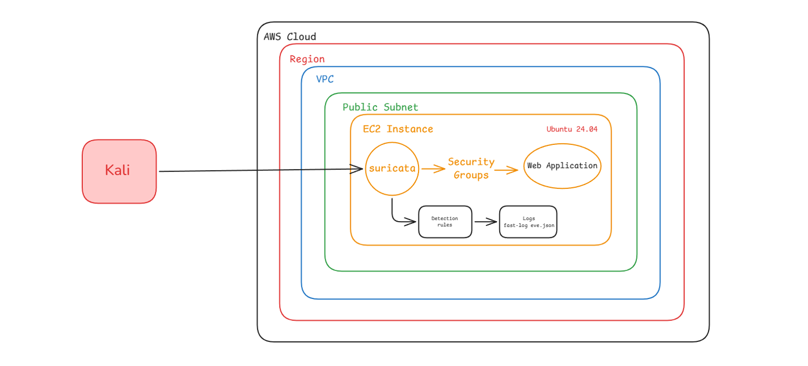

---

### Suricata Installation

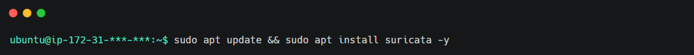
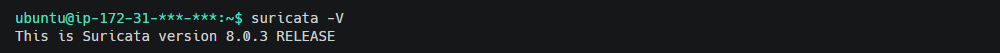

---

### IDS Mode Configuration

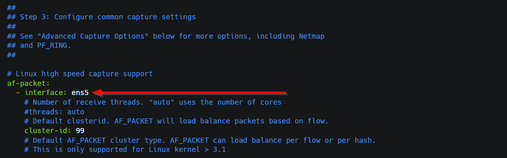
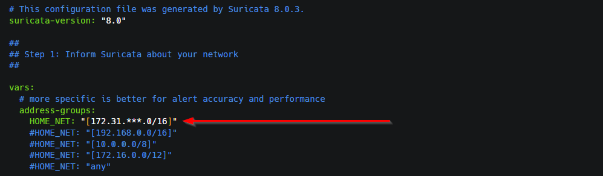
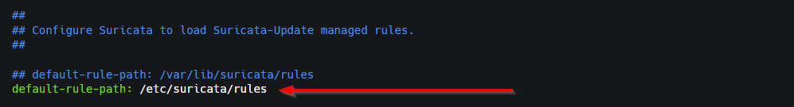

---

### Nmap Detection

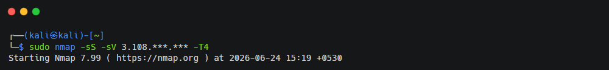
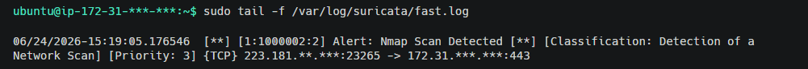

---

### Web Enumeration Detection

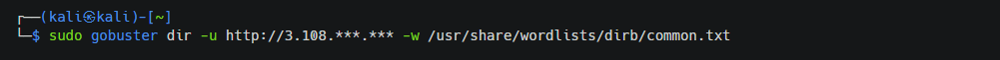
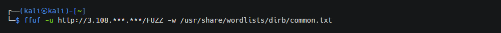
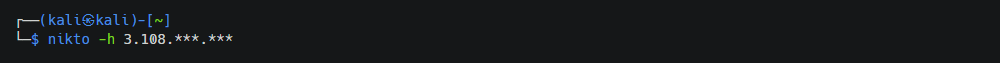
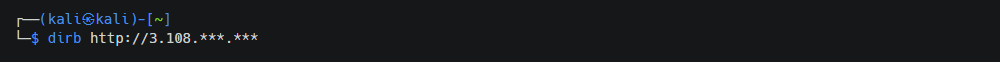
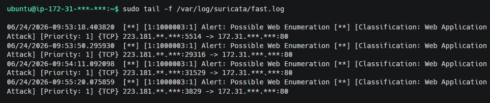


---

### DNS Exfiltration Detection

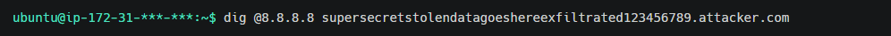
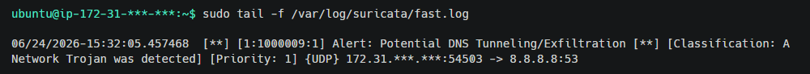


---

### IPS Mode Configuration

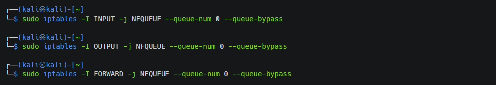
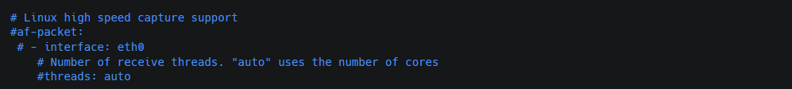
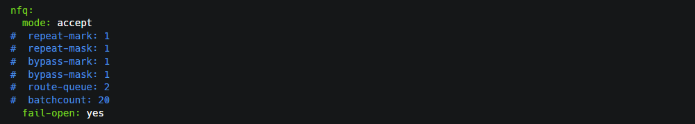
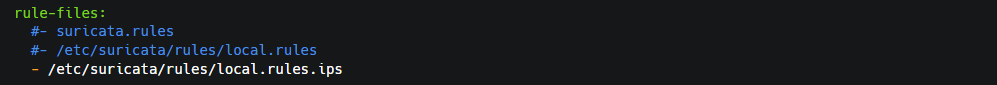

---

### ICMP Prevention

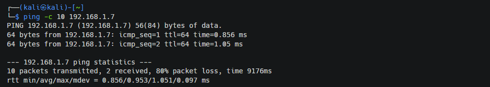


---

### cURL Outbound Request Prevention

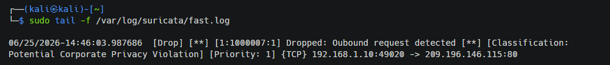

---

### Reverse Shell Prevention

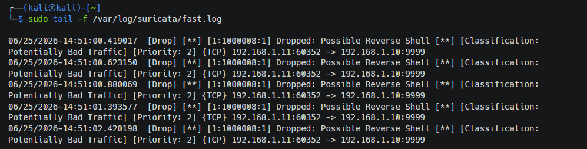

---

## Results

The project successfully demonstrated both IDS and IPS capabilities using Suricata.

Key outcomes include:

- Successfully developed custom detection signatures
- Detected multiple real-world attack techniques
- Validated alerts in IDS mode
- Prevented malicious traffic in IPS mode
- Reduced false positives using threshold-based rules
- Mapped detections to MITRE ATT&CK

---

## Skills Demonstrated

- Network Security
- IDS / IPS Deployment
- Detection Engineering
- Signature Development
- Linux Administration
- Threat Detection
- Packet Analysis
- Network Monitoring
- AWS Security
- MITRE ATT&CK
- Security Hardening

---

## Documentation

The complete implementation guide, configuration steps, rule explanations, attack simulations, validation, screenshots, and analysis are available in:


---

## Future Improvements

- Integrate Suricata with Splunk SIEM
- Enable Eve JSON logging
- Visualize alerts in Kibana/Wazuh
- Add Emerging Threats rules

---

## Author

**Aditya Yadav**

Mechanical Engineer transitioning into Cybersecurity with hands-on experience in Detection Engineering, SIEM, Vulnerability Management, Cloud Security and Network Defense.
